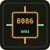

# emu8086web

Browser-based 8086 assembler and step debugger. A modernization of classic emu8086 for every platform — write, assemble, and debug MASM-style assembly entirely in your browser.

**Developed by [Nafis Islam Kabbo](https://nafiskabbo.vercel.app/)** · Version **1.3.0** · [MIT License](LICENSE) · [Changelog](CHANGELOG.md)

- Product: [https://emu-8086-web.vercel.app](https://emu-8086-web.vercel.app)
- Portfolio: [https://nafiskabbo.vercel.app](https://nafiskabbo.vercel.app)
- Source: [https://github.com/nafiskabbo/emu_8086_web](https://github.com/nafiskabbo/emu_8086_web)



## Quick start

Requires [Bun](https://bun.sh) 1.4+.

```bash
bun install
cp .env.example .env.local   # fill Supabase keys for share links
bun dev
```

Open [http://localhost:3000](http://localhost:3000) — the IDE opens directly.

### Environment

| Variable | Purpose |
|----------|---------|
| `NEXT_PUBLIC_SITE_URL` | Canonical site URL (sitemap, share links) |
| `NEXT_PUBLIC_SUPABASE_URL` | Supabase project URL |
| `NEXT_PUBLIC_SUPABASE_PUBLISHABLE_KEY` | Publishable key (optional for future client use) |
| `SUPABASE_SERVICE_ROLE_KEY` | **Server-only** — Share API (never commit / never `NEXT_PUBLIC_`) |
| `NEXT_PUBLIC_ENABLE_ADS` | `1` to show AdSense units, anything else (or unset) hides them. **Default off** — applies to web and desktop builds |

Run the `shared_programs` SQL from the 1.2.0 release notes / plan in the Supabase SQL editor (RLS on, service role only, hourly cleanup cron).

## Desktop (Electron, offline macOS build)

The same codebase ships as an offline macOS app. The packaged app starts its own bundled Next server on loopback (`127.0.0.1`), so assembling, stepping, running, and file save/open work with no internet. Short share links stay disabled while offline (they need the hosted API).

Requires macOS with Xcode command-line tools (`xcode-select --install`) for code signing utilities. No paid Apple Developer account is needed for local builds; the DMG will be unsigned, so first launch needs right-click → Open.

### Easy command

```bash
bun install
bun run dist:mac
```

Open the DMG under `dist/` (e.g. `dist/emu8086web-1.3.0-arm64.dmg`), drag the app to Applications, and launch it. On Apple silicon this builds `arm64`; on Intel Macs it builds `x64`.

### Step by step (same thing, explicit)

```bash
bun install                 # install web + Electron dependencies
bun run electron:dev        # live desktop window against `next dev` (development)
bun run electron:build      # web production build + stage the standalone server
bun run electron:dist:mac   # package the DMG for this Mac (calls electron:build first)
bun run electron:dist:mac-all  # DMGs for both arm64 and x64
```

### Notes

- Output lands in `dist/` (git-ignored): `.dmg` installer plus a `.zip` for direct distribution.
- Unsigned builds show “unidentified developer” on first launch: right-click → Open → Open. Distributing beyond your own machines needs an Apple Developer ID + notarization (not set up in this repo).
- Fonts and Vercel Analytics are inert without internet; the IDE itself is unaffected. Ads stay off unless `NEXT_PUBLIC_ENABLE_ADS=1` is set at build time (web and desktop alike).
- The web deployment is unchanged — `output: "standalone"` in `next.config.ts` also works on Vercel.

### Desktop menu, updates, and releases

- The app menu carries File (New/Open/Save/Save As), Assemble (Compile/Run/Pause/Step/Reset), standard Edit roles, View zoom/reload, Window, and Help (shortcuts, ASCII codes, converter, issue tracker, GitHub) — all wired into the IDE.
- Auto-update: the packaged app checks GitHub Releases after launch and offers a restart when a newer version is downloaded; “Check for Updates…” lives in the app menu. Publishing a release is one tag: `git tag v1.3.0 && git push origin v1.3.0` — the `release-desktop` workflow builds arm64 + x64 DMGs and attaches them to the release. Until Developer ID signing + notarization are configured, macOS installs the update from the downloaded DMG manually.

### Troubleshooting (desktop)

- `sandbox_extension_issue_file … Operation not permitted`: dev-only macOS sandbox denial. `electron:dev` already passes `--no-sandbox`; packaged builds keep the sandbox on.
- Window loads but buttons do nothing: stale dev server or blocked dev resources. Stop everything, rerun `bun run electron:dev`, and wait for “Ready” in the terminal before clicking. (`allowedDevOrigins` already covers the loopback host.)
- For exam-day confidence, test the packaged artifact itself (`bun run dist:mac` → install the DMG), not just the dev window — dev-only issues above do not apply to it.

## Features

- Multi-file workspace (tabs, open multiple `.asm` files, named Save / Save as)
- Compile, Run, Pause, Step, Reset with breakpoints
- Registers, flags (with Details view), data segment, hex memory dump, stack & call stack
- CRT console with DOS INT 21h / BIOS INT 10h / INT 16h I/O
- Broad 8086 instruction coverage (interpretive engine)
- Short share links (`/s/{code}`) with 1 / 3 / 7 day expiry, QR code, dedup; legacy `?p=` still loads
- Light/dark themes, accent color; Undo / Redo / Copy icons in Source panel
- Editor: indent-on-Enter, format document, tab size / word wrap
- Help tools: ASCII table, number converter, shortcuts, changelog, About
- Copy error for AI assistants from the error bar
- Resizable editor / console / CPU panels; responsive mobile & desktop layout
- Agent discovery: sitemap, robots Content-Signal, Link headers, Markdown Accept on `/`, API catalog, agent-skills, WebMCP, JSON-LD
- Vercel Analytics; manual AdSense placements; `ads.txt` + Google CMP for EEA/UK/CH

## Using the IDE

1. Write assembly or load a sample.
2. **Compile** (F5), then **Step** (F8) or **Run**.
3. Click gutter line numbers for breakpoints.
4. Use **+** on the tab bar for new files; double-click a tab to rename.
5. **Save** / **Save as** downloads the active file by name.
6. **Share** opens a dialog — pick expiry, generate short URL + QR.
7. **Help** → ASCII codes, converters, About, Settings (modal).
8. Undo / Redo / Copy icons sit next to the file name in the Source panel.

### Keyboard shortcuts

Defaults follow **IntelliJ** (switchable to VS Code in Help → Shortcuts). Mac shows ⌘/⌥; Windows shows Ctrl/Alt. Remap any chord in that panel.

| Action | IntelliJ (typical) |
|--------|-------------------|
| Compile | F5 |
| Step | F8 |
| Pause / close dialog | Esc |
| Save | ⌘/Ctrl+S |
| Shortcuts help | ⌘/Ctrl+Shift+/ or `?` |
| ASCII codes | ⌘/Ctrl+Shift+1 |
| Number converter | ⌘/Ctrl+Shift+2 |
| Format document | ⌘/Ctrl+⌥/Alt+F |
| Format selection | ⌘/Ctrl+⌥/Alt+Shift+F |
| Undo / Redo | ⌘/Ctrl+Z · ⌘/Ctrl+Shift+Z |

## Agent / SEO discovery

| Resource | Path |
|----------|------|
| Sitemap | `/sitemap.xml` |
| Robots + Content-Signal | `/robots.txt` |
| LLM context | `/llms.txt` |
| API catalog | `/.well-known/api-catalog` |
| Agent skills | `/.well-known/agent-skills/index.json` |
| Health | `/api/health` |
| Markdown for Agents | `Accept: text/markdown` on `/` |

**DNS-AID (optional, DNS provider):** publish SVCB/HTTPS discovery records under `_agents` for your domain pointing at the agent resources above. Sign with DNSSEC when available. This is configured in Cloudflare (or your DNS host), not in this repo.

## Supported assembly

See [docs/emulator.md](docs/emulator.md) for the instruction and interrupt matrix.

## Planned / roadmap

Not yet complete vs classic emu8086 (tracked in [project.md](project.md)):

- Virtual I/O devices (LED, 7-segment, stepper, traffic light)
- INT 10h graphics modes
- Binary opcode encoding / `.com` / `.exe` export
- Embedded tutorials
- Cycle-accurate timing
- Collaborative / cloud projects

## Project structure

```
app/                  Next.js routes (/ IDE, /s/[code], APIs, .well-known)
components/ide/       Editor, panels, toolbar, help, settings, share dialog
lib/emulator/         Assembler + CPU interpreter
lib/ide/              Workspace + emulator React hook
lib/share/            Share limits + rate limit helpers
lib/supabase/         Server Supabase client
docs/emulator.md      Engine reference
```

## Scripts

```bash
bun dev            # Development server
bun run build      # Production build
bun run lint       # ESLint
bun run typecheck  # TypeScript
bun test           # Emulator + offline-helper + ads-flag unit tests (`lib/`, `electron/`)
bun run verify     # lint + typecheck + test + build
bun run electron:dev      # Desktop window against `next dev`
bun run dist:mac          # Offline macOS DMG (this Mac's architecture)
```

## Contributing

This is an **open source** project. PRs welcome at [github.com/nafiskabbo/emu_8086_web](https://github.com/nafiskabbo/emu_8086_web). See [CONTRIBUTING.md](CONTRIBUTING.md) and [CODE_OF_CONDUCT.md](CODE_OF_CONDUCT.md).

## Tech stack

- Next.js 16 (App Router), React 19, TypeScript, Tailwind CSS 4
- Bun for install, scripts, and tests
- Emulator runs in the browser; Share API uses Supabase (optional until configured)

## Inspired by emu8086

A modern web reimagining of the classic [emu8086](https://emu8086-microprocessor-emulator.en.softonic.com/) teaching tool. Not affiliated with the original software.

## License

[MIT](LICENSE) © Nafis Islam Kabbo
